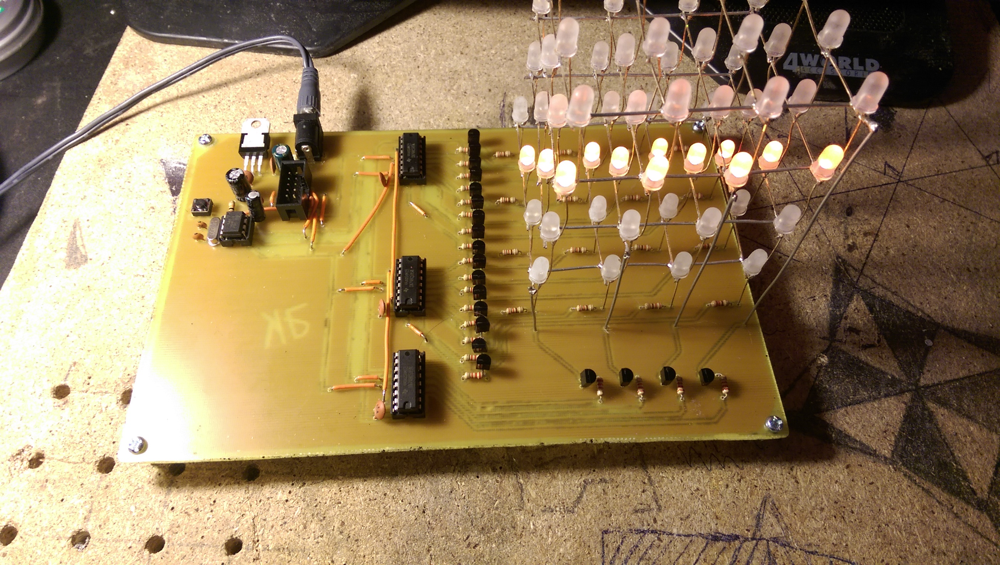
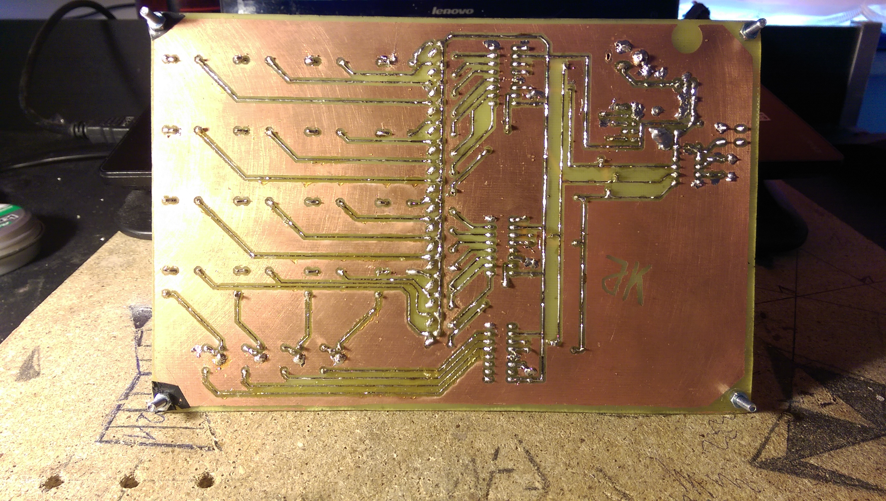
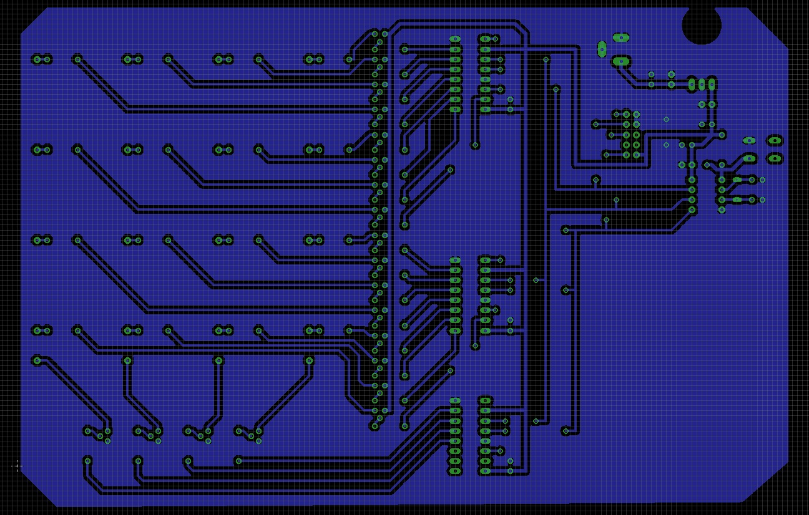
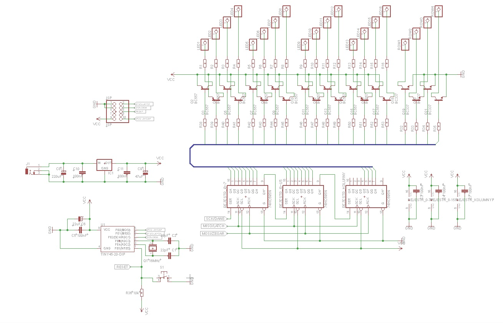

# LEDCube4x4x4, completed in February 2015
LEDCube4x4x4 project made using a 8-bit ATtiny45 microprocessor and three 74HC595N shift registers.
Atmel Studio was used to create, compile and flash binary.

I've published original source code with Polish spelling because I can't verify if the project is still working after porting to English (in terms of spelling mistakes/typos committed during porting).

Description of the repository tree:
```
root
│   README.md			// this file
│   diagram.jpg			// board electronic circuit diagram
│   pcb.jpg		        // printed circuit board
│   assembled_front.jpg         // a photo of a board from above
│   assembled_back.jpg 	        // a photo of a board from behind
│   demo.mp4                    // video showing the working board
│
└───src
│   │   main.c 			// main program loop
│   │   _moves.h	
│   │   _moves.c		// definition of animations
│   │   _cube.h
│   │   _cube.c			// I/O and interrupt initialization + interrupt implementation
```




